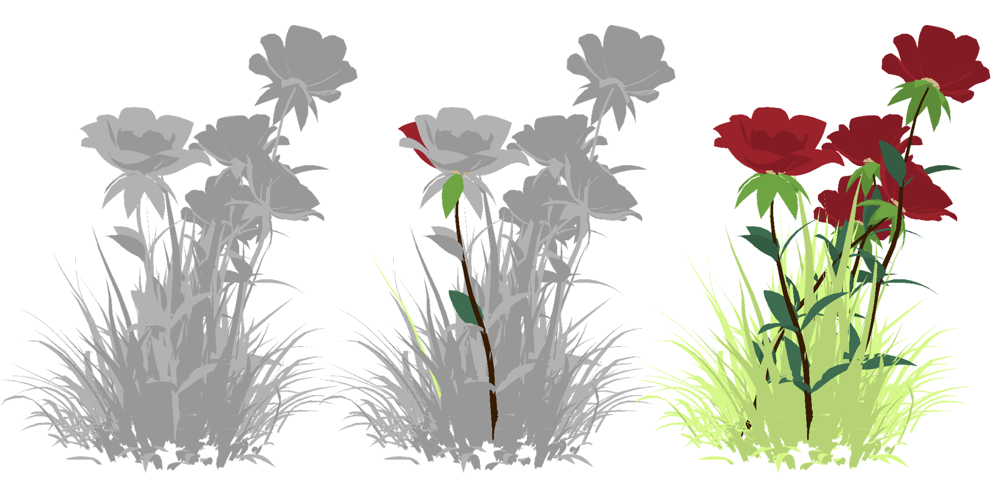

# Material Magic Wand: Material-Aware Grouping of 3D Parts in Untextured Meshes 
Umangi Jain, Vladimir Kim, Matheus Gadelha, Igor Gilitschenski*, Zhiqin Chen* (* indicates equal advising)<br> 

| [Project Page](https://umangi-jain.github.io/material-magic-wand/) | [Paper](https://arxiv.org/abs/2603.17370) |<br>


## Evaluation Testbench

We provide an evaluation testbench of 100 untextured meshes sourced from [Objaverse](https://objaverse.allenai.org/) with 241 human-refined part-level material grouping queries and multi-view renderings.

**Dataset:** [umangijain/material-magic-wand on HuggingFace](https://huggingface.co/datasets/umangijain/material-magic-wand)

### Contents

```
test-bench/
├── objaverse_uids.json              # 100 Objaverse UIDs
├── labels/{uid}/{id}_final.json     # 241 cleaned label files
├── val_renders/
│   ├── metadata.json                # per-render metadata (dedup renders used in paper)
│   └── images/{uid}.tar.gz          # one tar per mesh
└── val_renders_full/
    ├── metadata.json                # per-render metadata (full render set)
    └── images/{uid}.tar.gz          # one tar per mesh
```

Each label file contains the following fields:
- `material_id` — material group identifier
- `primary_query` — the part used as the query
- `original_selection` — original annotator selection
- `final_selection` — human-refined final part grouping


## Citation

```bibtex
@inproceedings{materialmagicwand2026,
  title={Material Magic Wand: Material-Aware Grouping of 3D Parts in Untextured Meshes},
  author={Jain, Umangi and Kim, Vladimir and Gadelha, Matheus and Gilitschenski, Igor and Chen, Zhiqin},
  booktitle={Proceedings of the IEEE/CVF Conference on Computer Vision and Pattern Recognition},
  year={2026}
}
```
